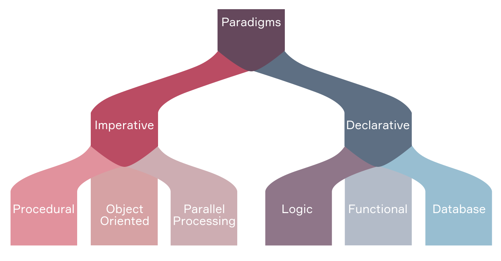

**strong text**# Paradigmas de programación
[toc]
* * *

Los paradigmas de programación son los estilos o maneras que hay para programar. Un lenguaje de programación puede satisfacer múltiples paradigmas o bien sobresalir en un estilo en particular.

## Paradigma imperativo

Como su nombre lo sugiere, este paradigma es similar a modo imperativo de los lenguajes naturales. Su enfoque principal es el cómo realizar la tarea por medio de una secuencia de pasos que la máquina debe seguir paso por paso.

El paradigma imperativo se divide en tres categorías: la programación procedimental (*procedural*), la programación orientada a objetos y la programación por procesamiento paralelo.

### Programación por procedimientos

En la programación procedimental, los programas se componen de secuencias de instrucciones que se dividen en bloques llamados procedimientos o rutinas. En este paradigma existe abstracción mínima entre el código y la máquina. Ejemplo: C, Pascal.

### Programación orientada a objetos

En este paradigma los programas se escriben como una colección de clases. Una clase es una entidad genérica o plantilla para construir objetos, las clases tienen propiedades y métodos que definen su comportamiento. Los objetos son instancias más específicas de las clases. Ejemplo: Java, C++, Ruby.

### Programación por procesamiento paralelo

Este paradigma reduce el tiempo de ejecución al distribuir las instrucciones en múltiples procesadores, en otras palabras, la programación por procesamiento paralelo consiste en dividir y vencer. Ejemplo: NESL

## Paradigma declarativo

La programación declarativa es el paradigma en el que se especifica el problema y el resultado esperado de la solución. En vez de pensar en cómo realizar una tarea, el enfoque es qué debe hacerse. De esta manera el sistema se encarga de tratar de encontrar una solución.

### Programación lógica

Este paradigma se basa en la lógica formal. Las sentencias de un programa esta formuladas de manera que expresan hechos y reglas sobre un área determinada. Las declaraciones básicas de este paradigma son:

- Hechos: afirmaciones sobre el dominio del problema (“Sócrates es un hombre”)
- Reglas: Inferencias a partir de los hechos en el dominio del problema (“Todos los hombres son mortales”).
- Consulta: son preguntas acerca del dominio ("¿Sócrates es mortal?"). Ejemplo: Prolog

### Programación funcional

En la programación funcional se trata el proceso de cómputo como la evaluación de una función matemática, en donde la entrada es un arreglo que no se modifica y la salida es un nuevo arreglo con nuevos datos (el valor de retorno). Ejemplo: JS, Clojure, Scala, Erlang.

### Programación de procesamiento de bases de datos

Este paradigma se base en el trabajo con datos. Las sentencias del programa con definidas por estos datos en vez de ser codificadas como series de pasos. Así, se accede a los datos para su filtrado, transformación y procesamiento. Ejemplo: SQL