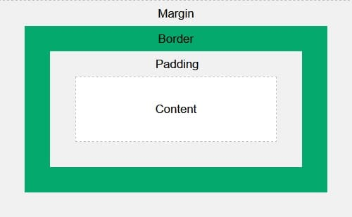

# Fundamentos de CSS

[toc]
***
## Sintaxis
Una regla de estilo en CSS está compuesta por tres elementos: un selector, una o más propiedades y los valores correspondientes a cada propiedad.


## Añadiendo CSS a HTML
### CSS en línea
Se añaden las reglas de CSS directamente sobre los elementos HTML. No usa selectores ya que se define dentro de la etiqueta del elemento a afectar. Para definir una regla CSS sobre un elemento se utiliza el atributo *style*.

```html
<body style="background-color:gray;">
```

### CSS interno
También conocido como CSS embebido, añade las reglas de estilo dentro del documento HTML usando la etiqueta `<style>` la cual está dentro de las etiquetas `<head>` del archivo HTML. Este método puede utilizarse para dar estilo único a página individuales.

```html
<head>
  <style>
    div {
      color: white;
      background-color: black;
    }
    p {
      color: red;
    }
  </style>
</head>
<body>...</body>
```

### CSS externo
Es el método más común, requiere crear una archivo .css y enlazarlo en el documento HTML. Para lograr esto, dentro de las etiquetas `<head>` del documento HTML, se definen las etiquetas `<link>` y se le agregan los atributos rel= “stylesheet” (define la relación entre el documento externo y el documento HTML) y href="\[ruta de la hoja de estilo\]"

```html
<head>
  <link rel="stylesheet" href="styles.css">
</head>
```

## Selectores
Los selectores hacen referencia los elementos HTML para aplicarles reglas de estilo CSS.

### Selector universal
Se denota con un asterisco (*), el selector afecta a todos los elementos de la página. Por ejemplo la regla:

```css
* {
  color: purple;
}
```

Hará que todo el texto de la página sea de color morado.

### Selector de tipo/elemento (E)
Afecta a todos los elementos con la etiqueta E. La siguiente regla cambia el color del texto dentro de los elementos `<p>` a rojo:

CSS

```css
p {
  color: red;
}
```

HTML

```html
<p>Lorem, ipsum dolor sit amet consectetur adipisicing elit. Qui, nobis.</p>
<div>Lorem ipsum dolor sit amet consectetur adipisicing elit.</div>
```

### Selector de clase (E.e)
Selecciona los elementos de tipo E que pertenecen a las clase e. En el siguiente código, el color de la fuente de los elementos `<p>` con la clase “aviso” cambian a rojo.

CSS

```css
p.aviso {
  color: red;
}
```

HTML

```html
<p>Lorem ipsum dolor sit amet.</p>
<p class="aviso">Lorem ipsum dolor sit, amet consectetur adipisicing elit.</p>
```

Puede definirse una clase para que aplique a cualquier etiqueta al escribir la regla CSS como .e. La siguiente regla cambien el color de la fuente a rojo para los elementos de la clase aviso.

CSS

```css
.aviso {
  color: red;
}
```

HTML

```html
<p>Lorem ipsum <span class="aviso">dolor</span> sit amet.</p>
<p class="aviso">Lorem ipsum dolor sit, amet consectetur adipisicing elit.</p>
```

### Selector de id (E#e)
Afectos los elementos de la ID dada. Dado que una ID debe ser única, este selector es de especificidad superior a los selectores de clase y tipo.

CSS

```css
#aviso {
  color: red;
}
```

HTML

```html
<p id="aviso">Lorem ipsum dolor sit amet.</p>
  <p class="aviso">Lorem ipsum dolor sit, amet consectetur adipisicing elit.</p>
```

### Selector de atributos
Es posible afectar elementos HTML de acuerdo a los atributos que estos tiene.

- E\[att\]: Afecta a elementos E con el atributo att
- E\[att=“val”\]: Afecta a los elementos E con el atributo att con exactamente el valor de val
- E\[att~=“val”\]: Afecta a los elementos E con el atributo att que tiene varios valores y uno de ellos es val
- E\[att|=“val”\]: Afecta a los elementos E con el atributo att cuyo valor es exactamente val o val seguido de un guion (-). Ejemplo CSS: `[class|="top"]` HTML: `<div class="top-text">`
- E\[att^=“val”\]: Seleccionar los elementos con si el atributo comienza con val
- E\[att$=“val”\]: Selecciona los elementos si el atributo termina con val
- E\[att*=“val”\]: Selecciona los elementos si el valor del atributo contiene la cadena de caracteres val

### Selector de grupo (,)
El selector de grupo se utiliza para aplicar las misma reglas de estilo a diferentes elementos HTML. En el siguiente ejemplo, los elementos h1, h2 y p tiene las mismas reglas:

```css
h1 {
  text-align: center;
  color: red;
}
h2 {
  text-align: center;
  color: red;
}
p {
  text-align: center;
  color: red;
}
```

Utilizando el selector de grupo se puede aplicar la mismas propiedades mientras se reduce el código.

```css
h1, h2, p {
  text-align: center;
  color: red;
}
```

### Combinadores
Los combinadores se utilizan para juntar selectores de acuerdo a la relación que hay entre ellos. Hay 4 tipos de combinadores en CSS:

- **Selector de Descendiente (E F)**: Afecta los elementos F que sean descendientes de los elementos E.
- **Selector de hijo (E > F)**: Afecta a los elementos F que son hijos del elementos E.
- **Selector de hermano adyacente/consecutivo (E + F)**: Selecciona los elementos F que están directamente después del elemento E. Deben compartir padre.
- **Selector de hermano genérico (E ~ F)**: Selecciona elementos F que sean hermanos de E.

### Pseudo-clases y pseudo-elementos
Las pseudo clases y los pseudo elementos permiten hacer referencia a determinados elementos son basarse en la información contenida en el árbol del documento.

#### Pseudo-clases
- :first-child -> Selecciona el primer elemento de un tipo dentro de otro
- :link -> Afecta el aspecto de los enlaces sin visitar
- :visited -> Afecto el aspecto de los enlaces ya visitados
- :hover -> Afecta el aspecto del elemento cuando el ratón se posiciona sobre él
- :active -> Afecta el aspecto de un elemento cuando se hace clic sobre él (y mientras se mantenga el botón de ratón presionado)
    :focus -> Afecta el aspecto de un elemento cuando tiene el foco (cuando el cursos del teclado está activo en ellos)

#### Pseudo-elementos
- ::first-line -> Afecta la primera línea del elemento seleccionado
- ::first-letter -> Afecta la primera letra del elemento seleccionado
- ::before -> Afecta o añade contenido antes del elemento seleccionado
- ::after -> Afecta o añade contenido después del elemento seleccionado

## Propiedades generales en CSS
### *color* y *background-color*
La propiedad color define el color del texto de un elemento, mientras que background-color define el color de fondo del elemento. Hay 4 formas de definir el valor de un color en CSS:

- **Texto**: Se define el color con palabra correspondiente en inglés. (ejemplo: green, blue, orange)
- **Hexadecimal**: Se definen con el carácter # seguido de un número hexadecimal de 6 dígitos, correspondientes a los valores de rojo, verde y azul. (ejemplo: #FA0532)
- **RGB/A**: Se definen con la palabra clave rgba seguido de los valores de rojo, verde, azul de 0 al 255, separados por comas y entre paréntesis. El valor de opacidad es opcional y su valor es de 0 a 1. (ejemplo: rgba(218,37,4,0.5))
- **HSL/A**: Se definen con la palabra clave hsla seguido de los valores de matiz de 0 a 360, saturación de 0% a 100%, brillo de 0% a 100%, separados por comas y entre paréntesis. El valor de opacidad es opcional y su valor es de 0 a 1. (ejemplo: hsla(150,88,70,0.1)).

### Básicos de tipografía
- **font-family**: Adopta el tipo de fuente para el documento. Se recomienda definir varios tipos de fuente en forma de una lista separada por comas en caso de que una no esté disponible. Existen fuentes genéricas (como monospace, serif y sans-seif) y fuentes especiales las cuales deben especificarse en el documento CSS.
- **font-size**: Esta propiedad modifica el tamaño de la fuente. Pueden darse valores absolutos o relativos.
- **font-weight**: Modifica el peso de la fuente, normalmente se define en incrementos de 100 hasta 900.
- **text-align**: Modifica la alineación del texto (centrado, a la izquierda, a la derecha, justificado).

### Modificadores de tamaño
Con las propiedades *height* y *width* se ajusta el tamaño de los elementos HTML. Generalmente se utiliza para ajustar el tamaño de imágenes.

## Cascada CSS
La Cascada es un concepto para determinar que reglas de estilo se aplican y cuáles no. Entre más abajo la prioridad en la cascada, la menor prioridad para aplicar la regla de estilo.

1.  Importancia
    1.1. Declaraciones de transición
    1.2 Declaración !important de navegador (user-agent)
    1.3 Declaración !important de usuario
    1.4 Declaración !important de autor (desarrollador)
    1.5 Declaraciones de animación
    1.6 Declaraciones normales
2.  Origen
    2.1 Declaraciones normales de autor (desarrollador)
    2.2 Declaraciones normales de usuario
    2.3 Declaraciones normales de navegador (user-agent)
3.  Especificidad
    3.1 Reglas en línea (inline)
    3.2 Layer o capa (@layer)
    3.3 ID
    3.4 Clase, atributo o pseudo clase
    3.5 Tipo o pseudo elemento
4.  Posición: La última jerarquía es el orden en que se definieron las reglas, la regla que se define al final es la que se aplica.

## Distancias y tamaños
En una página u hoja de estilo se pueden definir las distancias y tamaños como porcentajes o como valores absolutos y relativos.

### Unidades absolutas
Estas unidades son fijas. Se recomiendo no utilizarla para uso en pantalla porque el tamaño y resolución es variable en esos casos. Son adecuadas cuando se sabe de antemano el medio en que se mostrarán, como para hoja de impresión.

- cm: centímetros
- mm: milímetros
- in: pulgadas
- px: pixeles. Los pixeles son relativos de acuerdo al tipo de display, para pantallas con bajo dpi un pixel es un punto en la pantalla (pixel de dispositivo), para dispositivos con alto dpi, un pixel se compone de múltiples pixeles de dispositivo (retina displays)

### Unidades relativas
La unidades relativas especifican una dimensión en relación a otra propiedad. Estas unidades se escala de mejor forma entre distintos tipos de medios o dispositivos.

- em: relativo al tamaño de fuente del elemento (2em significa 2 veces el tamaño de la fuente actual)
- ex: relativo a la altura de la letra “x” en la fuente actual.
- ch: relativo a la altura del número “0” en la fuente actual.
- rem: relativo al tamaño de fuente del elemento raíz (el tamaño de fuente base del navegador)
- vw: relativo al 1% del ancho la ventana del navegador (*viewport*). SI la ventana es de 50cm, 1vw = 0.5cm.
- vh: relativo al 1% de la altura de la ventana del navegador
- vmin: relativo al 1% de la dimensión más pequeña del navegador
- vmax: relativo al 1% de la dimensión más grande del navegador
    Porcentaje (%): relativo al elemento padre, otra propiedad del mismo elemento, u otro.

## Importar fuentes
Existen dos formas de exporta fuentes:

1.  Utilizando la etiqueta HTML `<link>`
2.  Utilizando @import en CSS

## Modelo de caja
El modelo de caja es una convención en la que todo elemento HTML es una caja con los siguientes elementos: márgenes, bordes, acolchado y el contenido.



## Posición en CSS
- Estática (por defecto): Se posiciona de acuerdo con el flujo del documento.
- Absoluta: Sale del flujo pero le afecta el desplazamiento.
- Relativa: No sale del flujo, la posición se determina con respecto al lugar original del elemento.
- Fixed: Sale del flujo del documento, no es afectado por el desplazamiento.
- Sticky: Inicialmente respeta el flujo del documento, similar a relative, una vez que los valores de posición (top, bottom, left, right) se cumplen al desplazar la ventana, cambia a fixed.

## Propiedad *display* en CSS
- none: oculta el elemento
- block: muestra el elemento como elemento bloque
- inline: muestra el elemento como elemento en línea
- Inline-block: muestra el elemento como bloque en línea híbrido
- Flex: muestra el elemento como un contenedor flex de tipo bloque
- Grid: muestra el elemento como un contenedor grid de tipo bloque