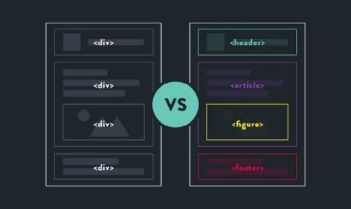
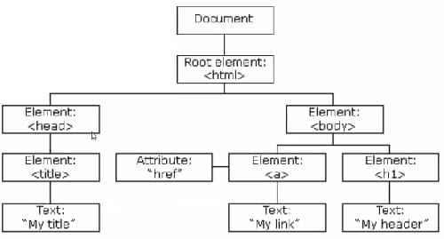

# Introducción a HTML
[toc]
***
## Estructura básica de un documento HTML
```html
<!DOCTYPE html>
<html lang="es">
<head>
  <meta charset="UTF-8">
  <meta http-equiv="X-UA-Compatible" content="IE=edge">
  <meta name="viewport" content="width=device-width, initial-scale=1.0">
  <title>Document</title>
</head>
<body>
  
</body>
</html>
```

	Elemento DOCTYPE
Le indica al navegador que versión de HTML usar para mostrar el documento. Para html5, se utiliza <!DOCTYPE html>.

	Elemento HTML
Es el elemento raíz, todos los demás elementos serán hijos de este elemento.

	Elemento HEAD
Dentro de este elemento se incluyen metadatos acerca del documento.

	Elemento META
Se sugiere siempre declarar este elemento para definir la codificación de caracteres de la página (charset="utf-8")

	Elemento TITLE
Define el título del documento HTML para mostrar en el navegador.

	Elemento BODY
En este elemento se incluye el contenido del documento HTML.

## Indentación y anidamiento
El anidamiento es el utilizar elementos dentro de otros elementos. Cuando se anidan elementos, se crea un relación padre-hijo entre ellos. Esta relación afecta como se comporta un elemento al definir reglas CSS y JS.

La anidación es una técnica para que la estructura de un documento sea más sencilla de leer y consta de agregar espacios a los elementos anidados.

## HTML Semántico
Es el uso de las etiquetas HTML para mejorar la legibilidad y el significado de la información en una página web. Esto permite crear sitios web más accesibles y más significativos para los motores de búsqueda.



## *Document Object Model (DOM)*
Es una interfaz que define la estructura lógica de un documento y la forma en la que se accede y manipula.

[Manipulación del DOM con JS](../../Generation%20Bootcamp/Desarrollo%20Web/JavaScript%20para%20desarrollo%20web.md)




## Elementos y etiquetas
Un elemento HTML es el componente fundamental que le da estructura y contenido a un documento web. Las etiquetas son palabras reservadas que delimitan el inicio y el final de un elemento HTML. Las partes de un elemento HTML son: la etiqueta de apertura, el contenido y la etiqueta de cierre.

### Encabezados
Los encabezados tienen un formato especial y se utilizan para dar jerarquía al contenido. Hay seis niveles de encabezados, desde `<h1>` hasta `<h6>`. Es importante emplear los encabezados en orden y no saltarse alguno para no alterar la semántica del documento.

### Párrafos
La etiqueta `<p>` se utiliza para crear párrafos.

### Elemento fuerte
La etiqueta `<strong>` resalta el texto en negritas. Afecta el comportamiento de un lector de pantalla (accesibilidad).

### Elemento de énfasis
La etiqueta `<em>` cambia el texto a itálicas. Se utiliza para enfatizar una sección de texto. Afecta el lector de pantalla.

### Lista desordenada
Las listas desordenadas se utlizan cuando el orden de los elementos no es importante. Para crear una lista desordenada, se utiliza la etiqueta `<ul>` y cada elemento de la lista se crea anidando `<li>` dentro del elemento `<ul>`.

### Lista ordenada
Para crear listas donde el orden si tiene relevancia, se utiliza la etiqueta `<ol>`, la creación de los elementos de lista se crean de la misma manera, anidando `<li>` por elemento.

>Las listas tienen una propiedad CSS llamada *list-style-type* que nos permite modificar la viñeta que aparecen al lado de cada elemento de lista.

## Atributos HTML
Los elementos en HTML tienen atributos; estos son valores adicionales que configuran los elementos o ajustan su comportamiento de diversas formas para cumplir los criterios de los usuarios.

### Atributo id
Es atributo id especifica un identificador único para un elemento HTML. Este valor debe ser único y no debe repetirse en el mismo documento.

## Enlaces absolutos y relativos
Los enlaces absolutos se utilizan cuando queremos enlazar contenido externo a nuestra página. Un enlace absoluto contiene el protocolo seguido de la ruta completa del recurso que enlazamos, por ejemplo: https://www.theodinproject.com/about.

Los enlaces relativos se utilizan para enlazar páginas en el mismo sitio web. Para crear este tipo de enlace se debe definir la ruta al contenido deseado relativa a la ubicación en donde se encuentra el documento desde el cuál se hace el enlace. Por ejemplo: dentro de la carpeta `link-and-images` hay dos documentos: index.html y about.html. Para crear un enlace a about.html desde index.html, se utliza la línea `<a href="about.html">` ya que ambos documentos están en el mismo directorio.

Para enlazar a una sección específica en un documento, primero se debe crear una id única para esa sección utilizando el atributo id. Después, en el atributo href de un enlace se incluye gato (#) seguido del id de la sección.

### Elemento ancla
Se utiliza para generar enlaces. Para crear un ancla, se rodea el texto que deseamos enlazar con la etiqueta `<a>`. Para definir el destino del enlace, se utiliza el atributo *href* seguido de la ruta de la página destino.

### Imágenes
Para mostrar imágenes en un documento HTML, se usa la etiqueta `` (elemento vacío, no se cierra). Se necesita incluir el atributo *src* para indicar la ruta de la imágen, asi como el atributo alt para agregar una descripción de la imágen con motivos de accesibilidad.

## Elementos en bloque y en línea
### Elementos de bloque
Los elementos en bloque ocupan todo el espacio del reglón en el que se colocan. Pueden alterar su dimensiones.

### Elementos en línea
Los elementos en línea (inline) ocupan sólo el espacio necesario. Sus dimensiones no puede ser alteradas.

### Elementos inline-block
Los elementos inline-block son elementos híbridos que ocupan solo el espacio que requieren y, al mismo tiempo, permite editar su altura y ancho.

## Formularios
Un formulario HTML se utiliza para obtener entradas por parte del usuario. En general, estas entradas son enviadas a un servidor para su procesamiento. Para crear un formulario en HTML, se utiliza la etiqueta `<form>`.

### Elementos de entrada para formularios `<input type="">`
El elemento `<input>` se utiliza para generar campos de entrada de usuario. Este elemento debe tener definidos los atributos de name y de id, de lo contrario la información del formulario no será enviada.
	
- Entrada tipo texto (text): muestra un campo de entrada de texto
- Entrada tipo número (number): muestra un campo para ingresar números. Los atributos min, max sirve para definir el intervalo aceptable de números.
- Entrada tipo email (email): Campo de texto específico para correo electrónico
- Entrada tipo contraseña (password): Campo para ingresar contraseñas. El texto aparece enmascarado.
- Entrada tipo radio (radio): Muestra un botón de radio (una sola opción de muchas)
- Entrada tipo caja (checkbox): Muestra una caja  (para seleccionar múltiples opciones)
- Entrada tipo enviar (submit): Muestra un botón para enviar la información del formulario
- Entrada tipo limpiar (reset): Muestra un botón para limpiar toda la información del formulario

El atributo *required* se utiliza en aquellos campos que deben tener un valor antes de enviar el formulario. En caso de estar vacíos, el formulario no se puede enviar.

### Elemento label
Define una etiqueta para los elementos del formulario. El atributo for de `<label>` debe ser igual al atributo id del elemento `<input>` asociado.

```html
<form>
    <div class="campo">
      <label for="nombre">Nombre</label>
      <input type="text" placeholder="Juan Torres" name="nombre" id="nombre">
    </div>

    <div class="campo">
      <label for="email">Email</label>
      <input type="email" name="email" id="email" placeholder="usuario@dominio.com" required>
    </div>

    <div class="campo">
      <label for="password"></label>
      <input type="password" name="" id="" required>
    </div>

	<div class="campo">
      <label for="radio">Radio</label>
      <input type="radio" name="radio" id="radio" value="opcion1">
    </div>

    <div class="campo">
      <label for="checkbox">Checkbox</label>
      <input type="checkbox" name="checkbox" id="checkbox" value="opcion2">
    </div>

    <div class="submit">
      <input type="submit" value="Enviar">
    </div>

    <div class="reset">
      <input type="reset" value="Limpiar">
    </div>
  </form>
```