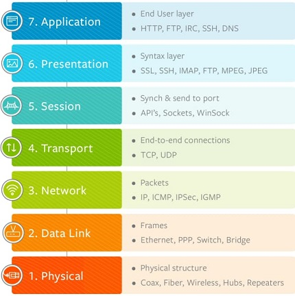
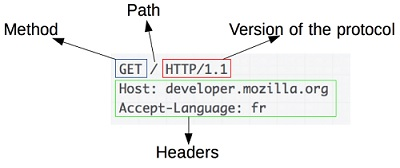
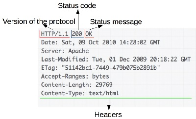

# Fundamentos de desarrollo web

[toc]

## Objetivos

- Explicar conceptos básicos sobre el internet
- Explicar el protocolo TCP/IP
- Explicar la diferencia entre cliente y servidor
- Explicar el protocolo HTTP

## Internet

El internet es una red de alcance global, los datos que se solicitan a través de internet se subdividen en paquetes los cuales se transportan mediante el protocolo TCP/IP. El enrutador es un dispositivo que dirige el tráfico de internet a el destino correcto.

> https://www.submarinecablemap.com/ es un sitio que muestra una visualización de los cable de fibra
> óptica que conforman el internet

### Modelo OSI

El modelo de Interconexión de sistemas Abiertos es una pila teórica de 7 capas o niveles que ayuda a comprender como opera una red y fue desarrollado con el fin de estandarizar sistemas de comunicación de red.

1.  **Física**: su responsabilidad es llevar la información a través de hardware físico
    (cables, tarjetas de interfaz de red, hubs)
2.  **Enlace de datos**: se ocupa del direccionamiento físico (direcciones MAC de origen y destino), switches
3.  **Red**: maneja direccionamiento IP y enrutamiento entre redes
4.  **Transporte**: añade los protocolos de transporte (TCP/UDP), añade puertos origen y destino
5.  **Sesión**: responsable de iniciar y terminar conexiones entre dispositivos
6.  **Presentación**: da formato a la información, encripta y desencripta de ser necesario
7.  **Aplicación**: toma lugar la comunicación entre usuario y aplicación, aplican protocoles específicos de aplicación (SMTP, FTP, etc.)

> Un mnemónico en inglés para recordar los niveles del modelo OSI es *“Please Do Not Throw Sausage Pizza Away”*.

Cuando hay comunicación entre redes, la información viaja a través del modelo OSI, añadiendo y procesando datos en cada nivel (encapsulación).-

> **Ejemplo**
> Cuando tu envías un correo electrónico, la aplicación de correo captura la información necesaria (cuerpo del correo, direcciones, metadatos, etc.) y la prepara para ser enviada por SMTP.
> 
> En la capa de presentación, se le da formato a la información de manera que el dispositivo receptor pueda interpretarla, utilizando ASCII en este caso. En este paso los datos puede encriptarse de ser necesario.
> 
> En la capa de sesión se inicia una conexión con el servidor receptor.
> 
> En la capa de transporte se decide entre usar TCP o UDP, se añaden los puertos de origen y destino.
> 
> En la capa de red se añade la dirección IP como destino y origen.
> 
> En la capa de enlace de red se añaden las direcciones MAC de los enrutadores y las direcciones MAC del anfitrión de origen.
> 
> En la capa física se envía la información mediante Ethernet.

### TCP/IP

Grupo de protocolos que hacen posible la transferencia de datos en redes.

- TCP: Protocolo de Control de Transmisión que permite establecer una conexión y el intercambio de datos entre dos anfitriones.
- IP: Protocolo de internet, utiliza direcciones series de cuatro octetos (binarios). Este protocolo lleva los datos a otras máquinas de la red.

El modelo TCP/IP estandariza redes computaciones y está basado en el modelo OSI, la diferencia radica en que la capas de sesión y presentación están unificadas junto con la capa de aplicación.

1.  Física (Bits)
2.  Enlace de datos (Trama)
3.  Red (Paquetes)
4.  Transporte (Segmentos)
5.  Aplicación (Datos)

### Arquitectura cliente servidor

- Cliente: computadora que realiza una petición
- Servidor: computadora que almacena la información y responde a las peticiones del cliente

## Protocolo HTTP

Protocolo de la capa de aplicación para la transmisión de documentos hipermedia, es decir, se encarga de la comunicación entre servidores y clientes (peticiones y respuestas de datos).

Una petición consiste de los siguientes elementos: El método, la ruta del recurso pedido, la versión del protocolo, cabeceras http (opcionales) y el cuerpo de mensaje.

Una respuesta HTTP contiene: la versión del protocolo, un código de estado que indica si la respuesta fue exitosa o no, mensaje de estatus, encabezados HTTP, y opcionalmente en el cuerpo se envía el recurso solicitado.

### Métodos HTTP

Cuando una petición se realiza a un servidor, se hace a través de métodos que indican la acción deseada a completarse. Cinco de los métodos más comunes en HTTPS son:

1.  **GET**: Obtiene datos desde el servidor.
2.  **POST**: Envía datos hacia el servidor.
3.  **PUT**: Reemplaza completamente información ya existente en el servidor.
4.  **PATCH**: Aplica modificaciones parciales a un recurso ya existente.
5.  **DELETE**: Elimina información del servidor.

### Códigos de estado

Los códigos de estado de respuesta HTTP indican si se ha completado satisfactoriamente una solicitud HTTP específica. Las respuestas se agrupan en cinco clases

1.  Respuestas informativas (100–199).
2.  Respuestas satisfactorias (200–299).
3.  Redirecciones (300–399).
4.  Errores del cliente (400–499)
5.  Errores del servidor (500–599).

## Aplicaciones web y sitios web

Los sitios web se basan en contenido (estáticos), mientras que las aplicaciones se centran en la interacción del usuario (dinámicos). Tanto las aplicaciones como los sitios web son construidos utilizando las tecnologías HTML, CSS y JavaScript.

[**HTML**](../../Generation%20Bootcamp/Desarrollo%20Web/Fundamentos%20de%20HTML.md)
HyperText Markup Language o Lenguaje de Marcado de Hipertexto estructura y le da formato a las páginas web.

[**CSS**](../../Generation%20Bootcamp/Desarrollo%20Web/Fundamentos%20de%20CSS.md)
Cascade Styling Sheets o Hojas de Estilo en Cascada es un lenguaje de diseño para modificar la apariencia de los elementos HTML.

**JavaScript**
JS es un lenguaje de programación que permite implementar funciones complejas. Con JS, se puede crear código que altera el comportamiento de una página.