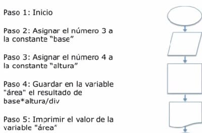
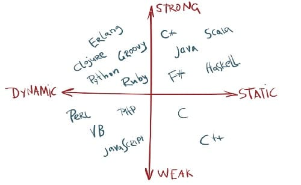
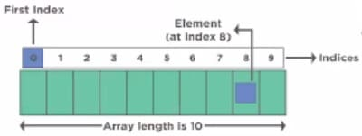

# Fundamentos de programación con JavaScript

[toc]
***
## Algoritmo
Un algoritmo es una secuencia de pasos que resuelve un problema y es la base de la programación. Las partes de un algoritmo son:

- **Entrada**: Son los datos que se le dan al algoritmo.
- **Proceso**: Operaciones que se hacen con los datos.
- **Salida**: Resultado final que se obtiene del proceso.

Las características de un algoritmo son:

- **Preciso**: Tiene que resolver el problema sin errores. Si ejecutas el algoritmo varias veces, los datos de salida serán iguales en cada repetición.
- **Definido**: Cada paso del algoritmo debe ser claro. Si ejecutas el algoritmo varias veces, los datos de salida serán iguales en cada repetición.
- **Finito**: Debe tener un inicio y un final.
- **Legible**: Cualquier persona que vea el algoritmo debe ser capaz de comprenderlo.

El **pseudocódigo** es una forma de representar un algoritmo utilizando convenciones de un lenguaje de programación real pero diseñado para la comprensión humana e independiente de todo lenguaje de programación.

El **diagrama de flujo** es la representación gráfica de un algoritmo. Estos diagramas emplean símbolos que representan diferentes tipos de instrucciones en el algoritmo y representan el flujo de ejecución mediante flechas.



## Tipos de lenguajes
- **Compilados**: traducen a código máquina, requieren que las instrucciones sean traducidas antes de ser ejecutadas.
- **Interpretados**: Las instrucciones se traducen una a la vez, requieren de un intermediario lo que aumenta el tiempo de ejecución

### Tipado en los lenguajes de programación
Los mayoría de los lenguajes de programación caen dentro de un cuadrante del sistema cartesiano donde un eje corresponde al tipado fuerte y débil (Cuán estricto es el tipado), y el otro corresponde al tipado estático y dinámico (Cuando se verifican los tipos). Convertir una variable de un tipo a otro se conoce como **casteo**.

- **Tipado estático**: Los tipos de las variables se verifican al compilar, antes de la ejecución. El tipo está relacionado a la variable
- **Tipado dinámico**: Los tipos de las variables se verifican durante la ejecución. El tipo está relacionado al valor.
- **Tipado fuerte**: No se realizan conversiones implícitas. Tipado estricto.
- **Tipado débil**: Conversión de tipo implícita cuando los tipos no concuerdan entre sí. Tipado laxo.



## JavaScript
JavaScript es un lenguaje plataforma y orientado a objetos de tipado débil. Es el lenguaje con mayor demanda laboral de toda la web. Tiene aplicación en front-end, back-end (NodeJS), bases de datos (MongoDB), móvil (React Native) y escritorio (Electron).

### Variables
Es un elemento de datos cuyo valor puede cambiar durante el curso de la ejecución de un programa. Las variable se ocupan para almacenar datos en memoria para su posterior utilización.

**var**
- Única forma de declarar variables antes de ES6
- Alcance global cuando se declara fuera de una función
- Pueden ser re-declaradas y actualizadas (reasignadas)
- Es afectada por el mecanismo de elevación, se les asigna el valor de *undefined*

**Let**
- Alcance de bloque (Un bloque es todo lo que está adentro de llaves: {bloque} )
- Puede reasignar su valor pero no puede re-declarase
- Pueden declararse sin valor (*undefined*)
- Es afectada por elevación, pero no se inicializan (Reference Error).

**Const**
- Alcance de bloque
- No pueden ser re-declaradas ni actualizadas (no confundir con inmutable, si la constante es un arreglo u objeto, sus propiedades pueden alterarse)
- No pueden declararse sin valor
- Es afectada por elevación, pero no se inicializa (mismo comportamiento que let)

#### Reglas para nombrado de variables
En JS se utiliza *lowerCamelCasing*.

#### Sintaxis de variables y constantes
Palabra reservada > nombre de variable > operador de asignación > Valor

### Hoisting o Elevación
Mecanismo de JS en donde las declaraciones de las variables, las funciones completas y clases se mueven a la parte superior de su contexto/alcance antes de la ejecución.

### Tipos de datos primitivos
El tipo de dato es una propiedad de un valor que determina valores que puede tomar, el tipo de operaciones que podemos realizar y cómo se representa de forma interna.

- **String**: Cadenas de caracteres (texto)
- **Number**: Valores numérico
- **Boolean**: representa una entidad lógica y puede tener dos valores: cierto (true) o falso (falso)
- **Null**: valor asignado de tipo null (nulo), representa la ausencia intencional de un valor de objeto.
- **Undefined**: una variable a la que no se le ha asignado ningún valor pero está declarada tiene el valor *undefined*

### Operadores
Los operadores son símbolos que permiten manipular o evaluar datos.

#### Operadores aritméticos
- Suma (+)
- Resta, inverso aditivo (-)
- División (/)
- Multiplicación (*)
- Exponenciación (**)
- Módulo (%)
- Incremento (++)
- Decremento (–)

#### Operadores de asignación
- Asignación de adición (+=)
- Asignación de sustracción (-=)
- Asignación de multiplicación (*=)
- Asignación de división (/=)

#### Operadores lógicos
- AND (&&)
- OR (||)
- NOT (!)

#### Operadores de comparación*
- Igualdad (==)
- No igualdad (!=)
- Identidad, igualdad estricta (===)**
- Estrictamente no igual (!==)
- Mayor que (>)
- Menor que (<)
- Mayor o igual que (>=)
- Menor o igual que (<=)

> \* La comparación de texto se hace en función al código ASCII. A (ASCII 65) < B (ASCII 66).

> \*\* JS es de tipado débil, es decir que convierte variable de un tipo a otro. La diferencia entre la igualdad y la igualdad estricta, es que la igualdad estricta compara no solo el valor, también el tipo. También aplica para la no igualdad y la no igualdad estricta.

### Control de flujo y ejecución condicional
Ejecuta una sentencia si una condición es evaluada como verdadera

#### if
Una declaración `if` ejecuta una instrucción si su condición es evaluada como verdadera. Si la condición se evalúa como falsa, otra instrucción puede ser ejecutada con las declaraciones `else if` y `else`.

```javascript
// Sintaxis (una instrucción)
if (condición)
  sentencia1
else if
  sentencia2
else
  sentenciaN
```

```javascript
// Sintaxis (múltiples sentencias)
 if (condición) {
   sentencia1
   sentencia2
   sentenciaN
} else {
   sentencia1
   sentenciaN
}
```

Lo que está dentro de las llaves se le conoce como **scope** o **alcance/contexto**

#### Switch
Una declaración `switch` compara el valor de una expresión con el valor de una etiqueta `case`. En caso de que coincidan, el programa ejecuta las instrucciones correspondientes.  Para asegurar que el programa únicamente ejecute el bloque de código asociado al `case` correspondiente y posteriormente salga del bloque `switch`, se utiliza la declaración `break`. La cláusula `default` se emplea para ejecutar código en caso de que no se encuentre coincidencia entre la expresión de `switch` y ninguna etiqueta.
```js
switch (expresion) {
  case etiqueta_1:
    enunciado_1
    [break;]
  case etiqueta_2:
    ënunciado_2
    [break;]
    …
  default:
    enunciado_def
    [break;]
}
```

### Bucles o ciclos
Secuencia de código que se ejecuta de manera repetida hasta que una condición deja de cumplirse. 

#### Bucle definido
Un bucle definido es aquel en el que se define de antemano las veces que va a repetirse. Para crear bucles definidos en JavaScript se utiliza una declaración  `for`.
```js
// Sintaxis de una declaración for
for ([expresiónInicial]; [expresiónCondicional]; [expresiónDeActualización]) {
	instrucción1;
	...
	instruccionN;
}  
```

#### Bucle indefinido
En un bucle indefinido no se conocen las veces en la que se repetirá el código, y puede ejecutarse un número indeterminado de veces. Para crear bucles indefinidos, se utilizan las declaraciones `do...while` y `while`.
```js
// Sintaxis de do...while
do {
	instrucción1;
	...
	instruccionN;
} while (condición);
```
```js
// Sintaxis de while
while (condición){
	instrucción1;
	...
	instruccionN;
}
```

La diferencia entre `do...while` y `while` radica en que `do...while` primero ejecuta y después evalua, mientras que `while` primero evalúa y después ejecuta. Esto significa que un caso en el que la condición a evaluar sea falsa, en el caso de `while` no se ejecutará el código dentro del bucle,  pero en el caso de  `do...while`, se ejecutará una vez.

### Funciones y métodos
Una **función** es un fragmento de código reutilizable para realizar una tarea específica. Los **métodos** son funciones específicas a cada tipo de datos que modifican su comportamiento. Los métodos se invocan mediante el operador punto (.) seguido del nombre del método y en caso de ser necesario, los argumentos entre paréntesis.

```javascript
// Sintaxis para declarar una función
function nombre (parametro1, parametro2, parametroN) {
    Instrucciones
    return a + b
}
```

#### [Funciones Avanzadas](../../Generation%20Bootcamp/Desarrollo%20Web/JavaScript%20para%20desarrollo%20web.md)

#### Método window.prompt(*arg*)
Muestra una ventana de dialogo que pide una entrada al usuario. El argumento se utiliza para mostrar un mensaje al usuario.

#### Método console.log(*arg*)
Imprime el argumento en la consola.

#### Función parseInt(*arg*)
Función para convertir el argumento en número entero.

#### Función String(*arg*)
Convierte el argumento en una cadena de caracteres.

#### Funcíon Number(*arg*)
Conveirte a tipo de dato númerico.

#### Boolean(*arg*)
Convierte a tipo de dato booleano.
 
### Arreglos
Un arreglo o array, es un tipo de dato estructurado que permite guardar un conjunto de datos ordenado. A cada dato le corresponde un índice que indica su posición numérica dentro del array.



```javascript
// Sintaxis para declarar un arreglo
let/var/const nombre = []; // Forma 1
let/var/const nombre = new Array(); // Forma 2
```

Para referir a un elemento en específico del arreglo, se utiliza la notación de corchetes: `nombreArreglo[indiceElemento]`

Esta notación se utiliza para referenciar valores específicos dentro del arreglo, sustituir los valores dentro del arreglo y añadir nuevos valores.

```javascript
const arr = [1,2,3,4,5];

arr[5]= 25; // añadir un valor 25
arr[6] = 8;
arr[6] = 0; //sustitución de valor de 8 a 0
arr[10] = 40; // añade elementos vacíos en los índices 7, 8 y 9
console.log(arr[8]); // undefined
```

#### Propiedades de los arreglos
Describen al arreglo.

- Longitud (*length*): número de elementos en el arreglo.

####  [Métodos específicos para arreglos](../../Generation%20Bootcamp/Desarrollo%20Web/JavaScript%20para%20desarrollo%20web.md)
Acciones que pueden realizarse sobre los arreglos.

### Objetos
Los objetos son estructuras de datos especiales que nos permiten guardar pares de valores.

```javascript
const obj = {
  //KEY  :  VALUE
  nombre : "Pedro",
  edad : 25 ,
  color : "Azul",
  pasatiempos: ["Leer", "Correr"]
}
console.log(obj); // Imprimir todo el objeto
console.log(obj.edad); // Imprimir las propiedades individuales
```

* * *

### Ejercicios de programación
#### Ejecución condicional y uso de métodos
Escribe un programa que pide la edad al usuario. Si es mayor de edad, imprime “Es mayor de edad”, en caso contrario “Es menor de edad”

```javascript
let edad = parseInt(prompt("Ingresa tu edad (con números):"));
if (edad >= 18) {
console.log("Es mayor de edad")
} else {
console.log("Es menor de edad")
}
```

#### Uso de console.log()
Para agilizar los procesos de una empresa se necesita desarrollar un algoritmo que permita calcular el sueldo de un empleado por semana y por mes. Como dato tenemos su sueldo diario ($600) y como salida se debe imprimir el nombre y el dinero que recibirá por semana y por mes.

```javascript
const sueldo = 600;
let nombre = prompt("Introduzca su nombre:");

let sueldoMensual = sueldo * 30;
let sueldoSemana = sueldo * 7;

console.log("Hola,", nombre);
console.log("Sueldo Mensual:", sueldoMensual);
console.log("Sueldo Semanal:", sueldoSemana);
```

#### Declaración de funciones
Mario quiere averiguar si un número es divisible entre 7 Y 8. Ayuda a Mario a escribir una función que tome un número. Si el número es divisible entre 7 Y 8, el programa debe retornar verdadero. Si el número no es divisible entre 7 Y 8, retornar falso.

```javascript
function divisionSieteOcho (input) {
  if (input % 7 == 0 && input % 8 ==0 ) {
    return true;
  } else {
    return false;
  }
}
let numero = parseInt(prompt("Ingresa un número entero:"));
console.log(divisionSieteOcho(numero));
```

Crear una función llamada obtenerGrado:

- Recibe como parámetro la cantidad de puntos obtenidos en un prueba
- El parámetro debe ser pedido al usuario
- La función debe pedir el nombre de la persona
- Retornara el nombre de la persona seguido del grado dependiendo de las siguientes reglas:
    25 < puntos <= 30, grado = A
    20 < puntos <= 25, grado = B
    15 < puntos <= 20, grado = C
    10 < puntos <= 15, grado = D
    5 < puntos <= 10, grado = E
    0 <= puntos <= 5, grado = F

```javascript
function obtenerGrado (puntos){
  if (puntos <= 30 && puntos > 25){
    return "A";
  } else if (puntos <= 25 && puntos > 20){
    return "B";
  } else if (puntos <= 20 && puntos > 15) {
    return "C";
  } else if (puntos <= 15 && puntos > 10) {
    return "D";
  } else if (puntos <= 10 && puntos > 5) {
    return "E"
  } else if (puntaje <= 5 && puntos >= 0){
    return "F";
  }
}
let nombre = prompt("Escribe tu nombre");
let puntaje = prompt("Escribe tu puntaje");
let grado = obtenerGrado(puntaje);
console.log("Nombre:", nombre);
console.log("Grado:", grado);
```

#### Declaración y manipulación de arreglos
```javascript
const personas = ["Maria", "Dani", "Luis", "Juan", "Camila"];
//Escribe un comando para remover a "Dani" del arreglo
personas.splice(1,1)
console.log(personas);
//Escribe un comando para remover a "Juan del arreglo"
personas.splice(2,1);
console.log(personas);
//Escribe un comando para agregar a "Luis" al inicio del arreglo
personas.unshift(personas[1]);
console.log(personas);
personas.splice(2,1);
console.log(personas);
//Escribe el comando para agregar tu nombre al final del arreglo
personas.push("Hector");
console.log(personas);
//Escribe el comando para mostrar la posición de "Maria"
console.log(personas.indexOf("Maria"));
//Escribe el comando para mostrar la posición de tu nombre
console.log(personas.indexOf("Hector"));


/*VERISON ALTERNA Agregar a Luis al inicio del arreglo
personas.splice(0,2,"Luis","Maria");
console.log(personas);
*/


/* VERSION ALTERNA 2 Agregar a Luis al inicio del arreglo
personas.unshift(personas.splice(1,1)[0]);
console.log(personas);
*/
```

#### Referenciar datos en arreglos multidimensionales
```javascript
const newArr = [1,45,"Hola","Adios",true,null, [30,31,32],["Azul","Amarillo","Verde"]];
console.log(newArr); // Imprime todo el contenido del arreglo
console.log(newArr[6][0]); // Imprime el numero 30
console.log(newArr[7][1]); // Imprime la cadena "Amarillo"
```
