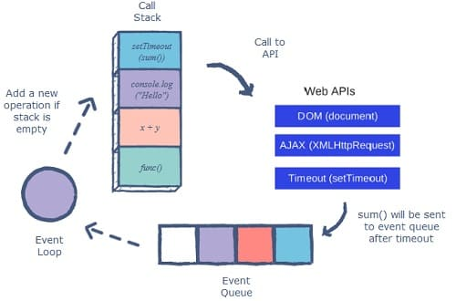

# JavaScript Asíncrono
[toc]
***
JavaScript es un lenguaje de programación de un solo subproceso o hilo, lo que significa que solo puede ejecutar una cosa a la vez. La **asincronía** es la la capacidad de JavaScript para ejecutar código de manera no secuencial.

## *Event Loop*
El bucle de eventos o *event loop* es el sistema que permite la ejecución asincrónica de código en JavaScript.

El primer elemento del bucle de eventos es la pila de llamadas o ***call stack***, la cual es responsable de mantener el registro de las operaciones a ser ejecutadas. El proceso que realiza la pila de llamadas es simple, cuando se está a punto de ejecutar una función, esta es añadida al stack. Si la función llama a su vez, a otra función, es agregada sobre la anterior.

La cola de eventos o ***event queue*** es responsable de recibir instrucciones asincrónicas y mandarlas a la pila para su processamiento una vez que la pila de llamadas este vacía. 

Cuando una instrucción asincrónicas es llamada desde el *call stack*, se envía a una API del navegador. Estas API proporcionadas por un navegador no están presentes en el runtime de JS y actúan como sus propios hilos/subprocesos separados. Después de manejar la instrucción especificada, las API mandan la operación a la cola de eventos.

El *event loop* verifica constantemente que la pila de llamadas este vacía. Si es el caso, se añaden las funciones en la cola de eventos, en caso de que no, se ejecuta la siguiente función en la pila.



## Funciones Callback
Las funciones retrollamantes o ***callback*** son basicamente funciones que pasamos como argumento a otra funcion. Esta funcion se ejecutara después de que otra lo haga. Este mecanismo nos ayuda a controlar que cierto codigo no se ejecute antes que otro termine. Por que sabemos que JS trabaja de forma descendente, entonces habra casos en que queramos hacer que un codigo se ejecute despues de que ocurra otra cosa, y tambien de forma no secuencial.
```js
// Ejemplo de función callback
const mensaje = function (){
    console.log("Este mensaje se mostrara despues de 3 segundos");
}
setTimeout(mensaje, 3000);

```

## Promesas

## *Async / Await*