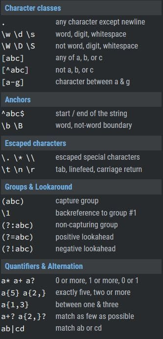

# JavaScript para desarrollo web

[toc]

* * *

## [Fundamentos de programación con JavaScript](../../Generation%20Bootcamp/Desarrollo%20Web/Fundamentos%20de%20programación%20con%20JavaScript.md)

## Modo estricto (‘use strict’)

Ejecuta el código JS en modo estricto. Las ventajas del modo estricto son las siguientes:

- Ayuda al motor JS a realizar optimizaciones
- Convierte los errores silenciosos (mala sintaxis) en errores reales que manifiestan un mensaje de error.
- Facilita el escribir código seguro en JS

### Restricciones del modo estricto

1.  No se permite usar variables sin declarar.

```javascript
'use strict'
a = 'hello'; // Arroja un error
```

2.  No se permite utilizar objetos sin declarar.

```javascript
'use strict';
person = {name: 'Carla', age: 25}; // Arroja error
```

3.  No se permite eliminar objetos.

```javascript
'use strict';
let person = {name: 'Carla'};
delete person; // Error
```

4.  No se permite duplicar nombres de parámetros.

```javascript
"use strict";
function hello(p1, p1) { console.log('hello')}; // Error
hello();
```

5.  No se permiten asignaciones a propiedades de no escritura, asignaciones a una propiedad captadora (*getter-only property*) ni asignaciones a una nueva propiedad en objetos no extensibles.

```javascript
// Asignación a una propiedad de no-escritura
var obj1 = {};
Object.defineProperty(obj1, "x", { value: 42, writable: false });
obj1.x = 9; // lanza un TypeError

// Asignación a una propiedad de tipo getter
var obj2 = { get x() { return 17; } };
obj2.x = 5; // lanza un TypeError

// Asignación a una nueva propiedad en un objeto no extensible
var fixed = {};
Object.preventExtensions(fixed);
fixed.newProp = "ohai"; // lanza un TypeError
```

6.  Se prohíbe el uso de notación octal prefijado por `0`

```javascript
var a = 010; // Error de sintaxis, se interpreta como octal
var a = 0o10; //Notación octal correcta
```

7.  Prohíbe el uso de `with`

```javascript
'use strict';
const x = 17;
with (obj) {   
    x; // Error de sintaxis
}
```

8.  `eval` limita el alcance de las variables únicamente al código que está siendo evaluado.

```javascript
var x = 17;
var evalX = eval("'use strict'; var x = 42; x;");
console.assert(x === 17);
console.assert(evalX === 42);
```

9.  `eval` y `arguments` no pueden ser utilizados para nombrar variables.

## Plantillas literales

Las plantillas literales (*template literals*) se delimitan con el carácter de comillas o tildes invertidas ( ), en lugar de las comillas sencillas o dobles. Se utilizan para realizar:

- Cadenas multi-línea

```js
console.log(`línea 1 de la cadena de texto
línea 2 de la cadena de texto`);
/* "línea 1 de la cadena de texto
línea 2 de la cadena de texto"*/
```

- Interpolación de cadena

```js
let a = 5;
let b = 10;
console.log(`Quince es ${a + b} y
no ${2 * a + b}.`);
// "Quince es 15 y
// no 20."
```

- Plantillas anidadas
- Plantillas etiquetadas

## Funciones avanzadas

### Expresión función

También conocida como expresión `function` , es una notación diferente para definir funciones. Las expresiones función puede tener nombre o ser declaradas como **anónimas**.

```js
// Sintaxis expresión función
let variable = function [nombreOpcional]([param[, param[, ...param]]]) {
   instrucciones
}
```

Las expresiones función no son afectadas por ***hoisting***.

### Función autoinvocante

Las funciones autoinvocantes o auto ejecutables (\*Immediately Invoked Function Expression, IIFE \*) son un tipo de función anónima la cual se ejecuta tan pronto son definidas.

```js
// Sintaxis función autoinvocante
(function (parametrosOpcionales) {
    enunciados
})(argumentosOpcionales);
```

### Función flecha

La funciones flecha son otra forma de declarar funciones, fueron introducidas en ES6.

```js
let nombreFuncion = (parametros) => {
    instrucciones
    return
}
```

Si la función contiene solo una instrucción, se pueden omitir las llaves y la palabra `return`.

### Las funciones son objetos

Las funciones son un tipo especial de objeto denominado **Objeto Función**. Al ser objetos, las funciones tienen pares de clave - valor y métodos asociados a ellas. Adicionalmente, se pueden crearse nuevas propiedades y nuevos métodos para funciones.

```js
// Creacion de una función de nombre holaMundo
function holaMundo() {
    console.log("Hola mundo");
}
holaMundo(); // Ejecuta la funcion

// Invocar la lista de propiedades de la funcion holaMundo como objeto
console.dir(holaMundo); // Muestra propiedades como .lenght y .name

// Aplicar un método a la función holaMundo
console.log(holaMundo.toString()); // Imprime la definicion de la funcion como cadena de texto

// Crear nuevas propiedades y métodos para la función holaMundo
holaMundo.autor = "Hector Gonzalez"  // Añade la clave "autor" con el valor de "Hector Gonzalez"
holaMundo.suma = function(a, b) {return a + b};  // Crea el método suma() para utilizar en la funcion holaMundo
```

## Métodos específicos para arreglos

### push(*arg*)

Agrega los valores dados como argumentos al final del arreglo.

```javascript
const frutas = ["manzana", "platano"];
console.log(frutas); // Dos elementos
frutas.push("naranja");
console.log(frutas); // Tres elementos: manzana, platano, naranja
```

### pop()

Elimina el último elemento de un arreglo y retorna el elemento eliminado. Este método cambia la longitud del arreglo.

```javascript
let elementoBorrado = frutas.pop(); // Elimina "naranja"
console.log(frutas);  // Quedan 2 frutas
console.log(elementoBorrado); // Imprime naranja
```

### shift()

Elimina el primer elemento de un arreglo y retorna el elemento eliminado. Modifica la longitud del arreglo.

### unshift(*arg*)

Añade los argumentos al inicio de un arreglo y devuelve la nueva longitud del arreglo.

### splice(*posicion*, *elementos a eliminar*, *elementos a agregar*)

Cambia el contenido de un array eliminando elementos existentes y/o agregando nuevos elementos.

### slice(*inicio*, *fin*)

Devuelve una copia de una porción del arreglo objetivo dentro de un nuevo arreglo delimitado por los valores de *inicio* y *fin* (fin no es incluido en la copia)

```js
  const arreglo = [1, 2, 3, 4, 5];
    let dato = arreglo.slice(0,2);
  console.log(dato);  // [1, 2]
  console.log(arreglo); // [1, 2, 3, 4, 5]

```

### sort(*compareFun*)

Ordena los elementos de un arreglo de acuerdo a su valor Unicode

```js
const arr = ["X", "A", "H", "a", "W", "b"];
arr.sort();
console.log(arr);  // [ "A", "H", "W", "X", "a", "b" ]

const arr2 = [5, 1231, 567, 1, 80];
arr3.sort();
console.log(arr2);  // [ 1, 1231, 5, 567, 80 ]
```

El parámetro *compareFun* es una función de comparación para ordenar los elementos cuando no se quiere usar el valor del caracter Unicode.

```js
const arr2 = [5, 1231, 567, 1, 80];
arr2.sort((a, b) => a - b)
console.log(arr2);  // [ 1, 5, 80, 567, 1231 ]
```

### forEach()

Toma una función y la ejecuta una vez por cada elemento del arreglo.

```js
// Sintaxis del método forEach

// Como función flecha
arr.forEach((element, [index], [array]) => { /* … */ })

// Callback function
arr.forEach(callbackFn)

// Inline callback function
arr.forEach(function(element, [index], [array]){ /* … */ })
```

## Expresiones regulares en JavaScript

[**Visitar RegexLearn**](https://regexlearn.com)
[**Apuntes de Expresiones Regulares**](https://lenguajejs.com/javascript/caracteristicas/expresiones-regulares/#propiedades-de-una-regexp)
[**Sitio para probar patrones**](https://regexr.com/)
Las expresiones regulares son patrones utilizados para encontrar una determinada combinación de caracteres dentro de una cadena de texto. En JavaScript, las expresiones regulares también son objetos y se utilizan en algunos métodos. Se emplean para:

- Búsqueda y reemplazo de un patrón en una cadena.
- Validación de campos en un formulario.

Hay dos formas para utilizar expresiones regulares en JS:

1.  Utilizando una representación literal de la expresión regular, que consiste en un patrón encerrado entre diagonales:

```js
var re = /ab+c/;
```

La representación literal ofrece la compilación de la expresión regular cuando se carga el script. Si la expresión regular permanece constante, utilizar esta forma ofrece el mejor rendimiento.

2.  Llamando a la función constructora del objeto *RegExp*:

```js
var re = new RegExp('ab+c');
```

El uso de la función constructora proporciona una compilación en tiempo de ejecución de la expresión regular. Es habitual usar la función constructora cuando se sabe que el patrón de la expresión regular cambiará, o cuando se desconozca el patrón y se obtenga de otra fuente, como del usuario.

### Propiedades de RegExp

- **source**: Devuelve una cadena de texto con la expresión regular original.
- **flags**: Devuelve una cadena de texto con las banderas que están activadas.
- **lastIndex**: Devuelve la posición donde se encontró una ocurrencia en la última búsqueda.
- **global**, **ignoreCase**, **multiline**, **unicode**, **sticky**: Comprueba si la bandera correspondiente está activa

### Banderas de RegExp

Las banderas son caracteres que modifican la manera en la que se manejan las coincidencias al usar expresiones literales.

```js
const re = /abc/igmuy;  // Agregar banderas en regex literal
const re = new RegExp('abc','igmuy');  // Banderas en constructor regex 
```

- **i**: Ignora mayúsculas/minúsculas
- **g**: Búsqueda global. Busca todas las coincidencias en lel texto en vez de solo la primera.
- **m**: busca coincidencias en cadenas multilínea.
- **u**: Habilita características Unicode
- **y**: Sticky. Busca sólo desde la posición indicada por *lastIndex*.

### Métodos de RegExp

- test(*str*): Comprueba si la la expresión regular se encuentra en *str*.
- exec(*str*): Devuelve un arreglo con las coincidencias

### Métodos String utilizados con expresiones regulares

- **match(*regexp*)**: Devuelve un arreglo que contiene todas las coincidencias, incluidos los grupos de captura, o *null* si no se encuentra ninguna coincidencia.
- **search(*regexp*)**: Prueba una coincidencia en una cadena. Devuelve el índice de la coincidencia, o -1 si la búsqueda falla.
- **replace(*regexp, reemplazp*)**: Ejecuta una búsqueda por una coincidencia en una cadena y reemplaza la sub-cadena coincidente con una sub-cadena de reemplazo.
- **split(*separador*)**:Utiliza una expresión regular o una cadena fija para dividir una cadena en un arreglo de sub-cadenas.

### Caracteres especiales

Los caracteres especiales permiten encontrar patrones cuando se necesita más que un coincidencia directa.



## [Manipulación del DOM con Java Script](../../Generation%20Bootcamp/Desarrollo%20Web/Document%20Object%20Model%20%28DOM%29.md) 

## [JavaScript Asíncrono](../../Generation%20Bootcamp/Desarrollo%20Web/JavaScript%20Asíncrono.md) 

## [Fetch y APIs de almacenamiento web](../../Generation%20Bootcamp/Desarrollo%20Web/Fetch%20y%20APIs%20de%20almacenamiento%20web.md)

