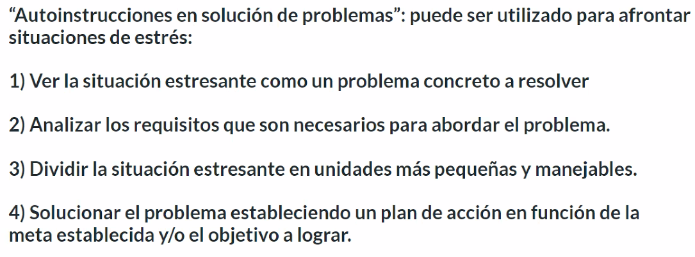

# Resolucion de conflictos

**Ejercicio**

1. Se perdío trabajo realizado a hacer un merge de manera incorrecta

2. 
	2.1 Investigar como pueden deshacerse commits
	2.2 Reorganizar nuestras homologar nuestras carpetas y nombres de archivo

3. 
	3.1 Hacer un checklist con los elementos que todos debemos tener en comun en nuestra carpeta de proyecto
	

4.
 	4.1 Hacer un reverse de nuestro repo en github
	4.2 Tomar tornos para hacer commits y merges
	4.3 Revisar que todo el repositorio esté en orden
