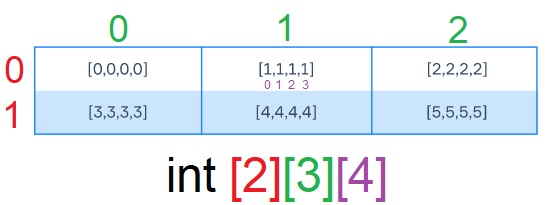

# Arreglos en Java
[toc]
Un arreglo o array, es un tipo de dato estructurado que permite guardar un conjunto de datos de manera ordenada. A cada dato le corresponde un índice que indica su posición numérica dentro del array.


En Java, los arreglos solo pueden contener datos del mismo tipo y tienen un tamaño fijo y predefinido.

- Los arreglos son un [tipo de dato por referencia](../Java/Literales,%20tipos%20de%20datos%20y%20variables%20en%20Java.md).
- Sus elementos son almacenados en memoria de manera secuencial.
- Cada elemento tiene un índice numérico que  empieza por 0 y se usa para acceder a él.
- El último elemento tiene un índice igual a la longitud del arreglo menos 1.
- Se puede crear arreglos con cualquier tipo de dato, pero sólo pueden almacenar elementos de ese tipo.

## Declaración de arreglos
Para declarar un arreglo, se utilizan los caracteres `[]` después de la declaración del tipo de elemento de arreglo.
```java
// Sintaxis
int[] arreglo; // Forma 1 de declarar un arreglo
int arreglo[]; // Forma 2 de declarar (menos común)
```
Para añadir valores al arreglo, se utilizan llaves y se colocan lo valores separados por comas.
```java
int[] numbers = { 1, 2, 3, 4 };

int a = 1, b = 2, c = 3, d = 4;
int[] numbers = { a, b, c, d };

float[] floatNumbers; // declaración 
floatNumbers = new float[] { 1.02f, 0.03f, 4f }; // Instanciación e inicialización
```
Cuando no se conoce los valores específicos del arreglo, se utiliza una instanciación por constructor especificando el tamaño del arreglo.
```java
int n = ...; // n es la longitud del arreglo
int[] numbers = new int[n];
```
Cuando se crea un arreglo de esta forma, los elementos toman el valor por defecto dependiendo del tipo de dato: `0` para numéricos, `false` para booleanos y `null` para tipos por referencia.

## Acceder a los elementos de un arreglo
Para establecer el valor de un elemento:
```java
arreglo[indice] = valor;
```
Para obtener el valor de un elemento:
```java
variable = arreglo[indice];
```
Es importante recordar que los índices de un arreglo van del $[0, longitud - 1]$.
```java
int[] numbers = new int[3]; // numbers: [0, 0, 0]
numbers[0] = 1; // numbers: [1, 0, 0]
numbers[1] = 2; // numbers: [1, 2, 0]
numbers[2] = numbers[0] + numbers[1]; // numbers: [1, 2, 3]
```

## Procesando arreglos
### Usando ciclos for
Podemos utilizar el método `length()` para iterar un arreglo dentro de un ciclo for. 
```java
int n = 10;
int[] squares = new int[n];

System.out.println(Arrays.toString(squares)); // [0, 0, 0, 0, 0, 0, 0, 0, 0, 0]

/* Iterando sobre el arreglo */
for (int i = 0; i < squares.length; i++) {
    squares[i] = i * i;
}

System.out.println(Arrays.toString(squares)); // [0, 1, 4, 9, 16, 25, 36, 49, 64, 81]
```

Los ciclos for pueden utilizarse para almacenar datos provenientes de la entrada estándar en un arreglo. Por ejemplo:
```java
// ENTRADA
5
101 102 504 302 881
	
// PROCESO
Scanner scanner = new Scanner(System.in);
        
int len = scanner.nextInt(); // lee la 1ra línea
int[] array = new int[len];  // Crea un arreglo con la longitud indicada
        
for (int i = 0; i < len; i++) {
    array[i] = scanner.nextInt(); // Lee el siguiente número y lo guarda en el arreglo
}

System.out.println(Arrays.toString(array)); // Imprime el arreglo
```


### Utilizando el ciclo for-each
Introducido en Java 5, el ciclo for-each es una forma especial de procesar un arreglo de un manera más descriptiva y sin utilizar índices.
```java
// Sintaxis del ciclo for-each
for (type var : array) { 
    //Declaraciones usando var
}
```
La sentencia anterior se lee: "por cada elemento `var` del tipo `type` en el arreglo `array`, realizar las sentencias en el bloque."

El ciclo for-each tiene limitaciones, no puede modificar el arreglo ya que no almacena el elemento de éste, sino una copia. Tampoco puede obtener un elemento por su índice y forzosamente itera cada elemento uno a la vez.
```java
char[] characters = { 'a', 'b', 'c', 'a', 'b', 'c', 'a' };

int counter = 0;
for (char ch : characters) {
    if (ch == 'a') {
        counter++;
    }
}
System.out.println(counter); // Imprime "3"
```

## Arreglos multidimensionales
Un arreglo multidimensional es un arreglo de arreglos, en otras palabras, un elemento de un arreglo contiene otro arreglo.

### Arreglos 2D
Los arreglos bidimensionales son comunes para representar coordenadas, tablas, matrices. Un arreglo 2D con 3 columnas y 3 filas se crea con el siguiente código:
```java
int[][] twoDimArray = {
        {0, 0, 0}, // first array of ints
        {0, 0, 0}, // second array of ints
        {0, 0, 0}  // third array of ints
};
```
No es necesario que las dimensiones del arreglos sean las mismas. Aquí un ejemplo de un arreglo 2D con diferentes dimensiones:
```java
int[][] twoDimArray = {
        {0, 0},       // the length is 2
        {1, 2, 3, 4}, // the length is 4
        {3, 3, 3}     // the length is 3
};
```

### Acceder a los elementos de un arreglo multidimensional
Se utiliza la notación de corchetes con $N$ índices, donde $N$ es el número de dimensiones del arreglo. En el caso de un arreglo 2D, el primer índice corresponde al arreglo principal y el segundo al arreglo anidado:
```java
int[][] twoDimArray = {
        {3, 4, 5},
        {6, 7, 8},
};
System.out.println(twoDimArray[0][0]); // 3
System.out.println(twoDimArray[0][1]); // 4
System.out.println(twoDimArray[0][2]); // 5
System.out.println(twoDimArray[1][0]); // 6
System.out.println(twoDimArray[1][1]); // 7
System.out.println(twoDimArray[1][2]); // 8
```

### Procesar arreglos con ciclos
Se requieren de tantos ciclos for como dimensiones en el arreglo. Para crear un arreglo con 2 filas y 10 columnas cuyos valores son todos 1, se utilizan dos ciclos for:
```java
int[][] twoDimArray = new int[2][10];

for (int i = 0; i < twoDimArray.length; i++) {
    for (int j = 0; j < twoDimArray[i].length; j++) {
        twoDimArray[i][j] = 1;
    }
}
```

Para imprimir los arreglos anidados, solo se utiliza un índice:
```java
for (int i = 0; i < twoDimArray.length; i++) {     System.out.println(Arrays.toString(twoDimArray[i]));
}
// SALIDA
// [1, 1, 1, 1, 1, 1, 1, 1, 1, 1]
// [1, 1, 1, 1, 1, 1, 1, 1, 1, 1]
```

Para imprimir todos los elementos e incrementar su valor por uno:
```java
for (int i = 0; i < twoDimArray.length; i++) {
    for (int j = 0; j < twoDimArray[i].length; j++) {
        twoDimArray[i][j]++;
        System.out.print(twoDimArray[i][j] + " ");
    }
    System.out.println();
}

// SALIDA
// 2 2 2 2 2 2 2 2 2 2 
// 2 2 2 2 2 2 2 2 2 2
```

### Arreglos tridimensionales
Una manera de visualizar arreglo tridimensionales es como una tabla donde cada elemento tiene un arreglo en lugar de un solo dato:



Para crear una arreglo como el de la imagen anterior, se requieren tres índices, el primero corresponde a las filas, el segundo a las columnas y el tercero al número de elementos en la posición indicada.
```java
int[][][] threeDimArray = new int[2][3][4];
int element = 0;

for (int i = 0; i < threeDimArray.length; i++) {
    for (int j = 0; j < threeDimArray[i].length; j++) {
        for (int k = 0; k < threeDimArray[i][j].length; k++) {
            threeDimArray[i][j][k] = element;
        }
        element++;
    }
}
```
Imprimiendo los arreglos anidados:
```java
for (int i = 0; i < threeDimArray.length; i++) {
    for (int j = 0; j < threeDimArray[i].length; j++) {
        System.out.print(Arrays.toString(threeDimArray[i][j]) + " ");
    }
    System.out.println();
}

// SALIDA
// [0, 0, 0, 0] [1, 1, 1, 1] [2, 2, 2, 2]
// [3, 3, 3, 3] [4, 4, 4, 4] [5, 5, 5, 5]
```
Para imprimir elementos individuales:
```java
System.out.println(threeDimArray[0][0][0]); // 0
System.out.println(threeDimArray[0][1][0]); // 1
System.out.println(threeDimArray[1][0][1]); // 3
System.out.println(threeDimArray[1][2][3]); // 5 - Último elemento del último arreglo
```

## Instanciación de arreglos multidimensionales con dimensiones variables
```java
int[][] copyArray = new int[twoDimArray.length][];
        for (int i = 0; i < twoDimArray.length; i++) {
            copyArray[i] = new int[twoDimArray[i].length];
            for (int j = 0; j < twoDimArray[i].length; j++) {
                copyArray[i][j] = twoDimArray[i][j];
            }
        }
```

## Métodos de arreglos
### length
Devuelve la longitud de un arreglo
```java
int[] array = { 1, 2, 3, 4 };        
int length = array.length;        
System.out.println(length); // 4
```

