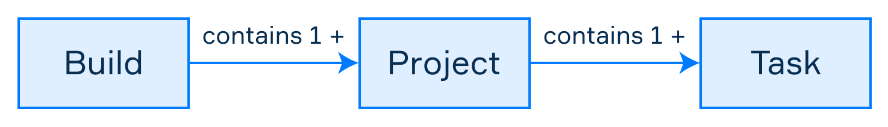

# Gradle
[toc]
***
Gradle es una herramienta de administración de proyectos y automatización que utiliza un lenguaje de dominio especifico basado en Groovy y Kotlin. Las principales características de Gradle son la siguientes:

- Gradle utiliza **archivo de configuración** para describir como se construye un proyecto.
- La **construcción por convención** evita que sea necesario describir cada paso en el proceso de construcción al hacer uso de configuración por defecto. Si es necesario, el comportamiento de la construcción puede ajustarse.
- Gradle automatiza  el **manejo de dependencias**, descargando las referencias externas que sean necesarias.
- Soporta el **construcciones multi-proyecto y construcciones parciales.**
- Tiene **facilidad de migración** al adaptarse fácilmente a cualquier estructura de proyecto que se tenga.
- El **DSL** provee de gran versatilidad para crear scripts de automatización. 

## Proyecto básico con Gradle
El siguiente diagrama ilustra los componentes en un *build* o construcción en Gradle:



Un **proyecto** representa **algo por construir** (como una archivo JAR), o bien, **algo por hacer** como desplegar una aplicación. Una construcción en Gradle puede tener uno o más proyectos.

Una **tarea** es un unidad de trabajo que realiza la construcción, como compilar clases, ejecutar pruebas o generar documentación. Cada proyecto es una colección de una o más tareas.

### Inicializar un proyecto
Dentro de una carpeta de proyecto, ejecutar el comando `gradle init`. Se deberá indica el tipo de proyecto y el lenguaje de dominio específico.

Terminado el proceso de generación, habrá un nuevo proyecto con la siguiente estructura:
```
.
├── build.gradle
├── gradle
│   └── wrapper
│       ├── gradle-wrapper.jar
│       └── gradle-wrapper.properties
├── gradlew
├── gradlew.bat
└── settings.gradle
```
- El archivo `build.gradle` especifica el proyecto, sus tareas y dependencias.
- Los archivos `gradle-wrapper.jar`, `gradle-wrapper.properties`, `gradlew`, `gradlew.bat` pertenecen a *Gradle Wrapper*, el cual permite utilizar Gradle sin una instalación manual.
- El archivo `settings.gradle` especifica los proyectos a incluir en la construcción.

El comando `gradle build`  construye el proyecto.

### Modificar el archivo de construcción
Dentro del archivo `build.gradle`, se agrega el siguiente código:
```groovy
description = "A basic Gradle project"

task helloGradle {
    doLast {
        println 'Hello, Gradle!'
    }
}
```
Se establece la propiedad `description` y se define una tarea simple que imprime `Hello, Gradle` en pantalla. Al ejecutar `gradle -q helloGradle`, se muestra la salida.

Para mostrar una lista de todas las tareas disponibles en un proyecto, se usa el comando `gradle tasks --all`. 

## Construcción de aplicaciones con Gradle
1. Ejecutar el comando `gradle init` dentro de una carpeta de proyecto `hyperskill-gradle-build`.
2. Seleccionar `application` como el tipo de proyecto, `Java` como el lenguaje de implementación y `org.hyperskill.gradleapp` como nombre del proyecto.

A continuación se muestra la distribución de carpetas del nuevo proyecto:
```
.
├── app
│   ├── build.gradle
│   └── src
│       ├── main
│       │   ├── java
│       │   │   └── org
│       │   │       └── hyperskill
│       │   │           └── gradleapp
│       │   │               └── App.java
│       │   └── resources
│       └── test
│           ├── java
│           │   └── org
│           │       └── hyperskill
│           │           └── gradleapp
│           │               └── AppTest.java
│           └── resources
├── gradle
│   └── wrapper
│       ├── gradle-wrapper.jar
│       └── gradle-wrapper.properties
├── gradlew
├── gradlew.bat
└── settings.gradle
```
En este árbol, puede notarse que el archivo `gradle.build` se encuentra dentro de la carpeta `app`, esto es porque se eligió `application` como tipo de proyecto.

### Plugins
En el archivo `build.gradle` se encuentra una sección de *plugins*, los plugins permiten extender las capacidades del proyecto, como añadir nuevas tareas o propiedades.
```gradle
plugins {
    // Apply the application plugin to add support for building a CLI application in Java.
    id 'application'
}

// Método antiguo para declarar plugins
apply plugin: "application"   // for Groovy DSL
apply(plugin = "application") // for Kotlin DSL
```

### Repositorios y Dependencias
Un repositorio es una ubicación en donde reside una dependencia. La sección `repositories` en el archivo `build.gradle` permite declarar los repositorios desde los cuales se obtendrán las dependencia externas del proyecto.
```groovy
repositories {
    // Use Maven Central for resolving dependencies.
    mavenCentral()
}
```

La sección de dependencias `dependencies` se usa para añadir dependencias externas.
```groovy
dependencies {
    // Use JUnit Jupiter for testing.
    testImplementation 'org.junit.jupiter:junit-jupiter:5.8.2'

    // This dependency is used by the application.
    implementation 'com.google.guava:guava:31.0.1-jre'
}
```

### Configuración de aplicación
La sección `application` define configuración para el plugin de aplicación. La única configuración obligatoria es el nombre de la clase principal de la aplicación.
```java
application {
    // Define the main class for the application.
    mainClass = 'org.hyperskill.gradleapp.App'
}
```

### Generación del archivo JAR
Primero se agrega la definición del encabezado `Main-Class` en el archivo `MANIFEST.MF`. Esto se logra en Gradle de la siguiente manera:
```groovy
jar {
    manifest {
        attributes("Main-Class": "org.hyperskill.gradleapp.App")   // for Groovy DSL
        attributes("Main-Class" to "org.hyperskill.gradleapp.App") // for Kotlin DSL
    }
}
```
Una vez realizada esta configuración, basta con ejecutar el comando `gradle jar` para generar el archivo JAR y después ejecutarlo con el comando `java -jar app/build/libs/app.jar`

### Construcción de la aplicación
Para generar una archivo `tar` y `zip` para distribuir la aplicación, se ejecuta el comando `gradle build`

## Manejo de dependencias
En la terminología de gestores de proyectos, toda librería externas se conoce como dependencia. En general, estas dependencias están empaquetadas como archivos JAR.

Para añadir una dependencia en un proyecto Gradle, se siguen dos pasos:

1. Se define el repositorio de donde se obtendrá la dependencia.
2. Se define la dependencia que se incluirá en el proyecto.

Existen repositorios locales y externos, Gradle cuenta con 4 aliases para agregar repositorios externos:

- mavenCentral()
- jcenter()
- mavenLocal()
- google()

Agregar un repositorio en un proyecto consiste en colocar el alias en la configuración de repositorios del archivo `build.gradle`
```gradle
repositories {
	mavenCentral()
	jcenter()
}
```
Cuando un archivo JAR no está disponible en un repositorio público, se coloca el archivo dentro de la carpeta `lib` del proyecto y se define en el archivo de construcción de Gradle:
```gradle
repositories {
	flatDir {
		dirs 'lib'
	}
}
```
Es importante mencionar que un repositorio plano `flatDir` no contiene metadatos, y en caso de que se encuentre una dependencia tanto en el repositorio plano como en un externo, se utilizará el externo.

Toda dependencia está agrupada de acuerdo con el alcance que tiene en el proyecto, por ejemplo, algunas se utilizan para compilar, mientras que otras solo necesitan utilizarse durante la ejecución. A estos alcances se le denominan **configuraciones**.Estas configuraciones determinan:
- La disponibilidad de una dependencia en los pasos de construcción.
- La necesidad de incluir dependencias en el artefacto de construcción final.
- La visibilidad de las dependencias para desarrolladores que utilizan tu proyecto como librería.

Los plugins de `java` y `kotlin` agregan las siguientes configuraciones a un proyecto:
- `implementation`: La dependencia está disponible durante la compilación y no está disponible para quienes usan el proyecto como librería.
- `compileOnly`: Define una dependencia que está disponible durante la compilación, pero no durante la ejecución.
- `runtimeOnly`: Se usa para definir dependencia que son necesaria únicamente durante la ejecución.
- `api`: similar a `implementation`, pero se expone a desarrolladores que utilicen el proyecto como librería.
> Las configuraciones `compile` y `runtime` pueden encontrarse en algunos proyectos, pero están depreciadas

Ejemplo de declaración de dependencias:
```gradle
dependencies {
    // This dependency is used by the application.
    implementation group: 'com.google.guava', name: 'guava', version: '28.0-jre'

    // Use JUnit test framework only for testing
    testImplementation 'junit:junit:4.12'

    // It is only needed to compile the application
    compileOnly 'org.projectlombok:lombok:1.18.4'
}
```