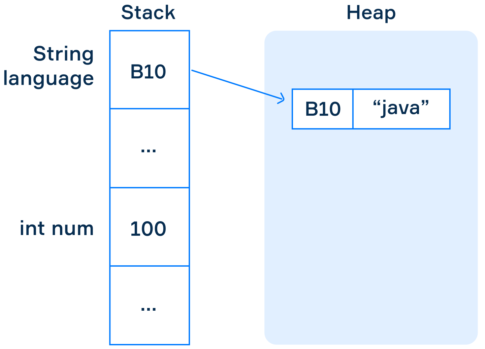
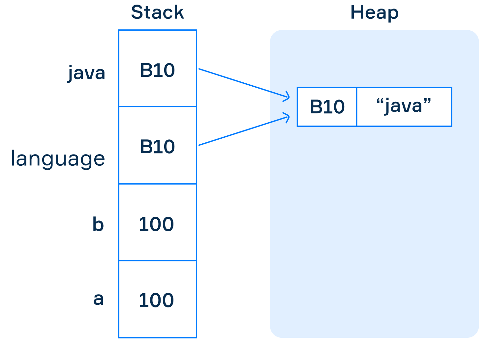
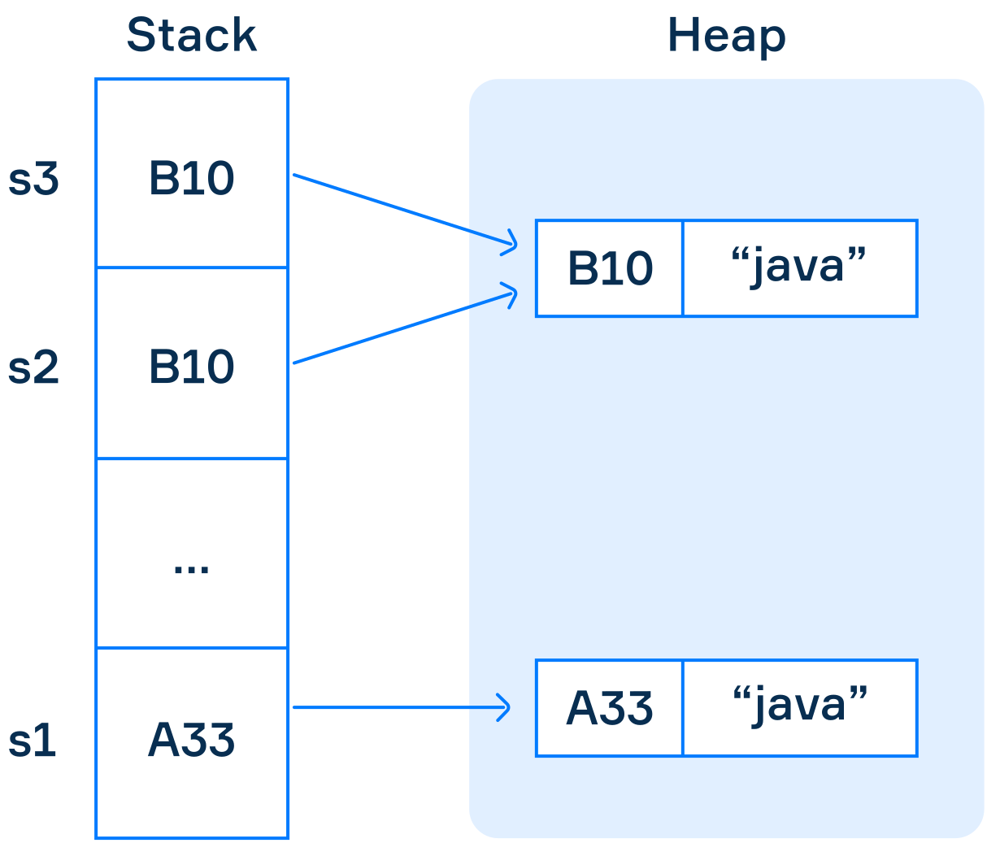

# Literales, tipos de datos y variables en Java
[toc]
***
## Literal
Un literal es la representación de código fuente de un valor de tipo primitivo, de una cadena de caracteres del tipo `String` o del tipo nulo `null`.

## Tipos de datos
Java es un lenguaje de **tipado estático**, lo que significa que cada variable y expresión tiene un tipo conocido durante la compilación. Java también es un lenguaje de **tipado fuerte** porque los tipos limitan los valores que puede tener una variable, las operaciones que pueden hacerse con esas variables y el significado de esas operaciones. El proceso de convertir de un tipo de dato a otro compatible se conoce como [**casteo**](../Java/Casteo%20de%20tipos%20en%20Java.md).

Existen dos tipos de datos en Java: tipos primitivos y tipos de referencia.

### Tipos de datos primitivos
- Booleanos: representan una cantidad lógica con dos valores, presentados por los literales `true` y `false`.
- Numéricos: Representan cantidades numéricas. Los hay de tipo entero y de tipo flotante.
    - byte: tamaño de 8 bits, valores máximos y mínimos \[-128,127\]
    - short: 2 bytes, valores \[-32768, 32767\]
    - int: 4 bytes, valores \[-2147483648, 2147483647\]
    - long: 8 bytes, valores \[-9223372036854775808, 9223372036854775807\]
    - char: representación de caracteres Unicode, tamaño de 2 bytes, valores \[’\\u0000’, ‘\\uffff’\]
    - float: 4 bytes, valores \[1.4E-45, 3.4028235E38\]
    - double: 8 bytes, valores \[4.9E-324, 1.7976931348623157E308\]

Los valores enteros son calculados con la expresión $[-2^{n-1}, 2^{n-1}-1]$, en donde $n$ es el número de **bits**. El intervalo superior incluye al cero, es por eso que se resta uno.

### Tipos de datos de referencia
Los tipos de datos de referencia contienen una referencia o dirección de memoria de los objetos a los que apuntan y no al su valor. Todos tienen un tamaño de 8 bytes.

- Objetos: instancias de clases
- Clases: Modelo o plantilla para crear objetos (String es una clase)
- Interfaces: Proveen de un supertipo y métodos abstractos a clases no relacionadas
- Arrays: estructura de datos de tamaño fijo que guarda elementos del mismo tipo

### Diferencia entre datos primitivos y de referencia
La principal diferencia es que los valores primitivos almacenan los valor que se les asigna, mientras que los valores de referencia almacenan la **dirección de memoria** en donde se encuentra el valor.



Esta diferencia afecta el mecanismo para asignar el valor de una variable a otra. En el caso de los valores primitivos, el valor se copia. En el caso de los valores de referencia, se copia la dirección donde está el valor.
```java
int a = 100;
int b = a; // 100 se copia a la variable b

String lenguaje = new String("java");
String java = lenguaje;
```
En el código anterior `b` tiene una copia del valor de `a` (100), mientras que `lenguaje` y `java` hacen referencia al mismo valor sin copiarlo.



La comparación de tipo de referencia también cambia con respecto a tipos primitivos, ya que se comparan referencias en vez de valores.
```java
String s1 = new String("java");
String s2 = new String("java");
String s3 = s2;

System.out.println(s1 == s2); // false
System.out.println(s2 == s3); // true
```



Por este motivo no deben usarse los operadores `==, !=` para hacer comparaciones y se deben utilizar el método especial `equals`.
```java
String s1 = new String("java");
String s2 = new String("java");
String s3 = s2;

System.out.println(s1.equals(s2)); // true
System.out.println(s2.equals(s3)); // true
```
Finalmente, los tipos de referencia puede tener el valor `null`, lo que significa que no ha sido inicializada aún o no tiene valor alguno.

## Variables
Una variable es un elemento de datos cuyo valor puede cambiar durante la ejecución de un programa. Las variables tienen 8 tipos/especies/clases (de las cuales 3 tiene la palabra variable en su nombre):

- Variable de instancia: Es una variable que se declara dentro de una clase y fuera de un método, puede tener valores únicos para cada instancia que la utiliza.
- Variable **estática** o de clase: Se crea al incluir la palabra `static` en una declaración de clase. Las variables estáticas tienen un mismo valor (tienen una sola encarnación) no importa el numero de instancias de clase (objetos) que existan.
- Variable local: Es cualquier variable declarada dentro de un método. Solo son visibles dentro del método en el que se declaran.
- Componentes de array: Variables sin nombre creadas cuando se crean un objeto tipo arreglo.
- Parámetros de método: El nombre que se le da las variables durante la declaración de un método y serán recibidas por éste.
- Parámetros de constructor
- Parámetros lambda
- Parámetros de excepción

La sintaxis para una variable en Java es la siguiente: el tipo de dato, el nombre o identificador de la variable, el operador de asignación y la inicialización.

```java
DataType variableName = initialization;
String language = "java";
```

### Variables finales
La palabra clave `final` antes de una variable la convierte en una **constante** o **variable final**, es decir, su valor no puede cambiar una vez sea asignado por primera vez. 

En el caso de los datos de tipo referencia, la variable final sella la referencia al objeto, no al objeto como tal. En el siguiente código, el objeto `builder` no puede ser reasignado a otra dirección de memoria.
 ```java
final StringBuilder builder = new StringBuilder();
builder = new StringBuilder(); // Error
```
Sin embargo, el valor del dato al que hace referencia si puede alterarse:
```java
final StringBuilder builder = new StringBuilder(); // ""
builder.append("Hola!"); // Se cambia el valor de "" a "Hola!"
System.out.println(builder.toString()); // Hola!
```
