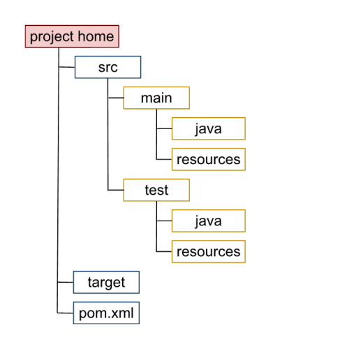

# Maven
[toc]
***
Apache Maven es una herramienta de gestión de proyectos basada en el concepto de *Project Object Model*, POM. Mediante el uso de Maven, un proyecto:
- Sigue un estructura consistente
- Es independiente del entorno de desarrollo
- Puede modificarse con facilidad
- Simplifica la declaración de dependencias

## Project Object Model
El modelo de objeto proyecto (POM) es la unidad de trabajo fundamental en Maven. Se trata de un archivo XML que contiene información sobre el proyecto y los detalles de configuración que Maven utiliza para su construcción. El archivo `pom.xml` brinda por defecto configuraciones que funcionan para la gran mayoría de los casos:
- El archivo `pom.xml` se localiza en el directorio base.
- La ubicación del código fuente: `src/main/java`
- Ubicación para lo recursos del proyecto: `src/main/resources`
- Las pruebas se ubican en `src/test/java`
- El directorio destino para aplicación construida es `target`.

