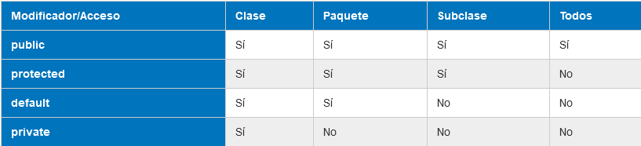

# Modificadores
[toc]
***
Los modificadores en Java son palabras clave que se agregan a la definición de un elemento para modificar su comportamiento. Existen dos clases de modificadores:
- Modificadores de acceso: Definen la visibilidad del elemento al que modifican.
- Modificadores de no acceso (*non-access modifiers*): Cambian el comportamiento del elemento modificado, ya sean clases, métodos, campos, interfaces o constructores.

## Modificadores de acceso
### Público
El elemento puede accederse desde cualquier parte.

### Protegido
El elemento puede accederse dentro del paquete, o fuera de éste mediante herencia.

### Por defecto
Cuando no hay palabra clave, se considera un modificador por defecto. El acceso está restringido al paquete y la clase donde se define el elemento.

### Privado
El acceso sólo está permitido dentro de la clase en donde se define el elemento

## Modificadores de métodos
### Abstracto
Los métodos con el modificador `abstract` no pueden se implementados en su definición. Su implementación debe ser creada mediante herencia.

### Estático
Los métodos `static` pertenecen a una clase sin referencia particular a un objeto y puede ser accedido sin instanciación. Los métodos no estáticos son conocidos como **métodos de instancia**.

### Final
Los métodos con el modificador `final` no pueden ser sobrescrito o anulado.

### Nativo
Los métodos `native` son implementados en un lenguaje dependiente de plataforma (como C) y se usan para acceder a interfaces y funciones no disponibles en Java.

### Sincronizado
Los métodos `synchronized` se utilizan para evitar errores de interferencia en ejecución multihilo. 
